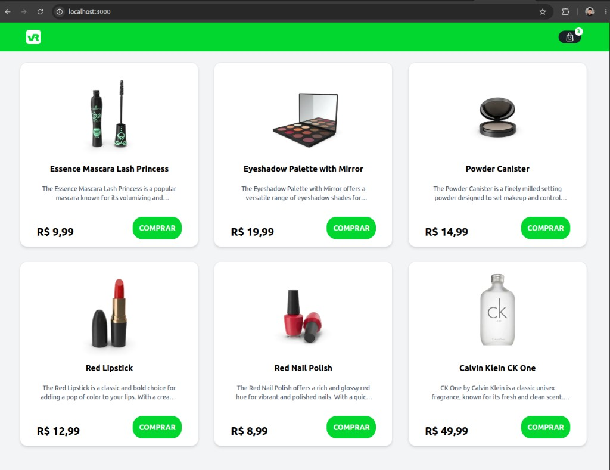
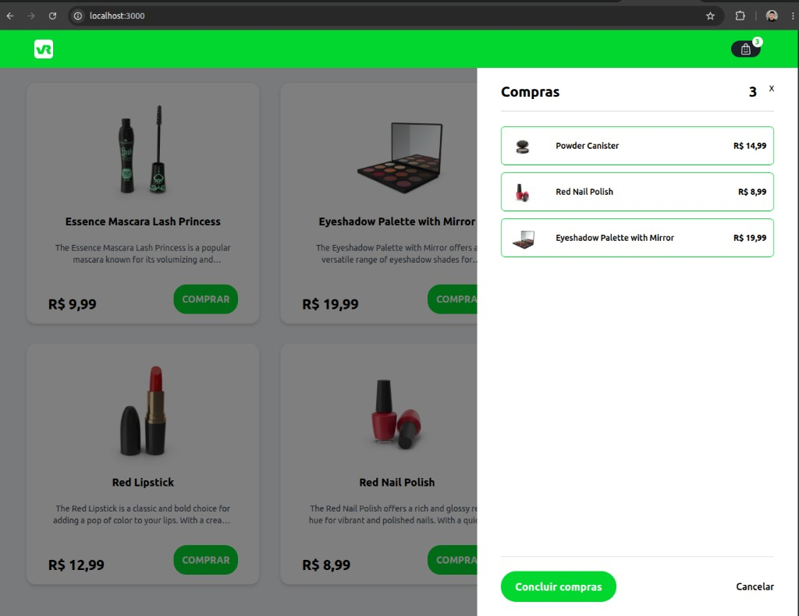

# VR MFE Shopping

Projeto de e-commerce em arquitetura **micro front-end**: listagem de produtos, carrinho de compras e estado compartilhado entre host e remotes.

---

## Capturas de tela

Ambiente local (`http://localhost:3000`) com host e remotes em execução.

### Listagem de produtos (ProductList)

Header (remote `header`), grid de cards (remote `cards`) e footer (remote `footer`) integrados pelo host.

<p align="center">
  
</p>

### Carrinho de compras

Painel lateral do carrinho no host, com itens adicionados e contador sincronizado no header via `@repo/cart-store`.

<p align="center">
  
</p>

---

## Arquitetura

O monorepo usa **Turborepo** para orquestrar apps e pacotes. A interface é dividida em um **host** (shell) e três **remotes** via **Webpack 5 Module Federation**:

| App | Papel | Porta (dev) | Expõe / Consome |
|-----|--------|-------------|------------------|
| `apps/host` | Host — monta a página | 3000 | Consome header, cards e footer |
| `apps/header` | Remote | 3001 | `./Header` |
| `apps/cards` | Remote | 3002 | `./Cards` |
| `apps/footer` | Remote | 3003 | `./Footer` |

O pacote `packages/cart-store` centraliza o estado do carrinho com **Zustand** e é consumido pelo host, header e cards (singleton compartilhado pelo Module Federation).

```
my-turborepo/
├── apps/
│   ├── host/      # shell + modal do carrinho
│   ├── header/    # topo (logo, busca, ícone do carrinho)
│   ├── cards/     # listagem de produtos
│   └── footer/
└── packages/
    └── cart-store/   # store Zustand compartilhada
```

> Os apps `web` e `docs` (Next.js) são resquícios do template Turborepo e **não fazem parte** do fluxo micro front-end deste teste.

---

## Requisitos

| Ferramenta | Versão |
|------------|--------|
| **Node.js** | `>= 18` (recomendado: 18 LTS ou 20 LTS) |
| **npm** | `>= 9` (o projeto declara `npm@11.3.0` como gerenciador) |

Verifique com:

```bash
node -v
npm -v
```

---

## Tecnologias

- **React 18** — UI dos micro front-ends
- **Turborepo** — monorepo, scripts paralelos e cache de build
- **Webpack 5 + Module Federation** — host e remotes independentes
- **Tailwind CSS 3** — estilização utilitária
- **Zustand** — estado global leve do carrinho (`@repo/cart-store`)
- **Jest + React Testing Library** — testes unitários e de integração
- **ESLint** e **Prettier** — lint e formatação

---

## Como rodar o projeto

Todos os comandos abaixo devem ser executados **dentro da pasta `my-turborepo`** (raiz do monorepo com `package.json` e workspaces).

### 1. Instalar dependências

```bash
cd my-turborepo
npm install
```

### 2. Subir o ambiente de desenvolvimento

É necessário subir **host e os três remotes ao mesmo tempo** (Module Federation em dev).

```bash
npm start
```

Equivalente: `npm run dev`.

O Turbo sobe em paralelo:

- Host → http://localhost:3000
- Header → http://localhost:3001
- Cards → http://localhost:3002
- Footer → http://localhost:3003

**Acesse apenas o host:** http://localhost:3000

Os remotes são carregados dinamicamente pelo host; abrir as portas 3001–3003 isoladamente serve só para debug do remote.

### Rodar a partir da pasta pai do repositório

Se o clone tiver a estrutura `vr-mfe-shopping/my-turborepo/`:

```bash
cd vr-mfe-shopping
npm install          # na raiz, se houver dependências
npm start            # delega para my-turborepo
```

---

## Scripts disponíveis

Executar na raiz de `my-turborepo`:

| Script | Comando | Descrição |
|--------|---------|-----------|
| `start` / `dev` | `npm start` | Sobe host + header + cards + footer em paralelo |
| `build` | `npm run build` | Build de produção (Turbo em todos os pacotes com script `build`) |
| `lint` | `npm run lint` | ESLint via Turbo |
| `format` | `npm run format` | Prettier em `ts`, `tsx` e `md` |
| `check-types` | `npm run check-types` | Checagem de tipos (apps TypeScript do template) |

Cada app MF (`host`, `header`, `cards`, `footer`) também expõe localmente:

| Script | Comando (dentro do app) | Descrição |
|--------|-------------------------|-----------|
| `start` | `npm start` | `webpack serve` em modo development |
| `build` | `npm run build` | `webpack --mode production` → pasta `dist/` |
| `test` | `npm test` | Jest |

Build apenas dos micro front-ends (opcional, mais rápido):

```bash
npx turbo run build --filter=mf-host --filter=header --filter=cards --filter=footer
```

---

## Testes

Testes com **Jest** e **React Testing Library** em:

- `apps/host` — componentes e fluxo do carrinho
- `apps/header` e `apps/cards`
- `packages/cart-store` — store e helpers

Por app:

```bash
cd apps/host && npm test
cd apps/header && npm test
cd apps/cards && npm test
cd packages/cart-store && npm test
```

Ou, a partir da raiz do monorepo (pacotes com testes implementados):

```bash
npx turbo run test --filter=mf-host --filter=header --filter=cards --filter=@repo/cart-store
```

> O app `footer` ainda não possui arquivos de teste; incluí-lo no `turbo run test` sem filtro pode falhar.

---

## Build

Gera artefatos estáticos em `dist/` em cada app MF:

```bash
npm run build
```

Saída principal:

- `apps/host/dist/` — `index.html` + bundles do host
- `apps/header/dist/remoteEntry.js` (+ chunks)
- `apps/cards/dist/remoteEntry.js`
- `apps/footer/dist/remoteEntry.js`

**Desenvolvimento:** `npm start` usa localhost (`3001–3003`) via `apps/host/mf-remotes.config.js`.

**Staging / produção:** edite os placeholders em `mf-remotes.config.js` ou defina variáveis no deploy:

| Variável | Uso |
|----------|-----|
| `MFE_ENV` | `development` \| `staging` \| `production` (padrão: dev no start, prod no build) |
| `MFE_REMOTE_HEADER_URL` | URL base do remote header (sem `/remoteEntry.js`) |
| `MFE_REMOTE_CARDS_URL` | URL base do remote cards |
| `MFE_REMOTE_FOOTER_URL` | URL base do remote footer |

Exemplo: `npm run build:staging` no app host (`MFE_ENV=staging`). Ver `apps/host/.env.example`.

Fluxo mínimo de deploy:

1. Build dos quatro apps MF.
2. Publicar cada `dist/` em um servidor estático (ou paths no mesmo domínio).
3. Ajustar URLs em `mf-remotes.config.js` ou via env vars acima.
4. Garantir CORS se host e remotes estiverem em origens diferentes.

---

## Melhorias futuras

- `MiniCssExtractPlugin` para CSS em produção (hoje via `style-loader`)
- Testes no `footer` e script `test` unificado na raiz do monorepo
- Pipeline CI com `build`, `test` e `lint` filtrados só nos pacotes MF
- Remoção ou isolamento dos apps `web` e `docs` do template Turborepo

---

## Referências

- [Turborepo — Running tasks](https://turborepo.dev/docs/crafting-your-repository/running-tasks)
- [Webpack Module Federation](https://webpack.js.org/concepts/module-federation/)
